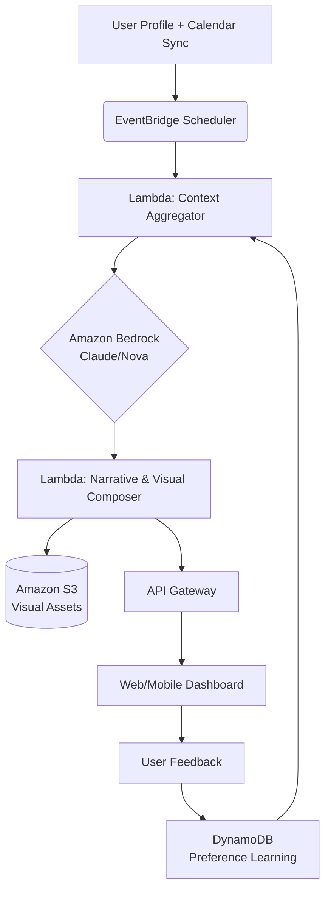

[](https://imsamitava-bat.github.io/Style-Forge-Personalized-Fashion-Generation/)

# 🌐✨ AI Lifestyle Concierge: Context-Aware Daily Planning & Visualization Engine

## 🧠 Overview: Your Digital Intuition, Materialized

AI Lifestyle Concierge is a sophisticated, serverless generative AI platform that transcends simple outfit suggestions. It acts as a holistic context engine, synthesizing your calendar, local weather, personal goals, real-time events, and aesthetic preferences to generate not just recommendations, but a complete, visualized narrative for your day. Instead of reacting to requests, it proactively architects your ideal daily experience, rendering it through stunning AI-generated visuals and a step-by-step actionable plan.

Imagine a tool that doesn't just suggest an outfit for a meeting, but understands the meeting's cultural context, the commute weather, your post-work fitness goal, and a local art opening you might enjoy—weaving it all into a coherent, beautiful guide. This repository contains the complete infrastructure to build that anticipatory intelligence.

## 🚀 Key Capabilities & Features

*   **🧩 Multi-Modal Context Fusion:** Seamlessly integrates data from Google/Outlook Calendar, OpenWeatherMap, location services, and user-defined profiles to build a rich situational understanding.
*   **🎨 Dynamic Visual Storytelling:** Leverages Amazon Bedrock's image generation models (like Nova Canvas) to create immersive visual previews of your recommended day, from morning coffee to evening attire.
*   **📜 Intelligent Narrative Generation:** Uses large language models (Claude via Bedrock, OpenAI GPT-4) to generate eloquent, personalized daily briefs that explain the *'why'* behind each suggestion.
*   **⚙️ 100% Serverless & Scalable:** Built on AWS Lambda, API Gateway, EventBridge, and S3, ensuring zero infrastructure management and cost-effective scaling.
*   **🔒 Privacy-Centric Design:** Processes personal data ephemerally within Lambda functions; no persistent storage of sensitive calendar or location details unless explicitly configured.
*   **🌍 Multilingual & Adaptive UI:** The frontend and generated content adapt to user language preferences, providing a native experience globally.
*   **🔄 Real-Time Re-optimization:** Submit ad-hoc changes (e.g., "Meeting canceled") and receive a re-optimized plan in seconds.

## 📋 Prerequisites & Compatibility

| Emoji | OS | Supported | Notes |
| :--- | :--- | :--- | :--- |
| 🖥️ | Windows 10/11 | ✅ | Requires WSL2 for local development |
| 🍎 | macOS 11+ | ✅ | Recommended for development |
| 🐧 | Linux (Ubuntu 20.04+, Fedora) | ✅ | Ideal for deployment |
| ☁️ | AWS CloudShell | ✅ | For direct cloud deployment |

**Software Requirements:**
*   Node.js 18+ / Python 3.9+
*   AWS CLI v2 configured with appropriate credentials
*   SAM CLI or CDK v2 (for infrastructure deployment)
*   An AWS Account with access to **Amazon Bedrock** (requires model access request)

## 🏗️ Architecture: The Symphony of Services

The system is designed as an event-driven pipeline. The core flow is visualized below:



## ⚙️ Configuration: Defining Your Digital Persona

Configuration is driven by a structured YAML profile. This file is the "seed crystal" for your daily planning.

```yaml
# user_profile.yaml
persona:
  name: "Taylor"
  style_archetype: "Tech-Minimalist with Vintage Accents"
  core_goals: ["Sustainable Choices", "Mindful Productivity", "Cultural Exploration"]
  intensity_preference: 7 # 1 (Low-Key) to 10 (Maximized)

context_sources:
  calendar:
    provider: "google" # or "outlook", "ical"
    focus_keywords: ["Client", "Presentation", "Deadline"]
  weather:
    provider: "openweathermap"
    parameters: ["temperature", "precipitation", "uv_index"]

constraints:
  budget_alert_threshold: 150
  carbon_footprint_goal: "low"
  time_buffer_minutes: 15

output_preferences:
  primary_language: "en-US"
  visual_style: "Photorealistic"
  delivery_time: "07:00"
  formats: ["web_dashboard", "email_summary", "mobile_push"]
```

## 🚦 Deployment & Invocation

### 1. Infrastructure Deployment
Deploy the entire serverless stack using the AWS SAM template.

```bash
sam build
sam deploy --guided --stack-name ai-lifestyle-concierge
```
This will provision all necessary AWS resources: Lambda functions, API Gateway endpoints, S3 buckets, DynamoDB tables, and EventBridge rules.

### 2. Profile Configuration
Upload your `user_profile.yaml` to the designated S3 configuration bucket created during deployment.

```bash
aws s3 cp ./config/user_profile.yaml s3://<YourConfigBucket>/profiles/taylor.yaml
```

### 3. Generating Your Daily Plan
Invoke the concierge engine manually via the secured API endpoint for testing.

```bash
# Example using the API Gateway endpoint
curl -X POST https://<your-api-id>.execute-api.<region>.amazonaws.com/Prod/generate \
  -H "x-api-key: <YourApiKey>" \
  -H "Content-Type: application/json" \
  -d '{
    "profile_id": "taylor",
    "date": "2026-05-15",
    "override_context": {
      "special_note": "Need to buy a gift for a colleague's farewell."
    }
  }'
```

### 4. Review Output
The response will be a JSON payload containing:
*   `daily_narrative`: A rich-text summary of your day.
*   `visual_plan_url`: Secure, time-signed URLs to generated images in S3.
*   `timeline`: A structured hourly breakdown.
*   `considerations`: Weather, logistical tips, and goal alignments.

## 🔌 Integration with Advanced AI Models

This engine is model-agnostic. It primarily uses **Amazon Bedrock** for unified, secure access to foundation models. For specific tasks, it can be configured to route requests to other endpoints:

*   **Amazon Bedrock (Claude 3 Sonnet/Haiku):** Primary engine for narrative generation, context analysis, and reasoning.
*   **Amazon Bedrock (Nova Canvas/Stable Diffusion):** Primary engine for high-fidelity image generation.
*   **OpenAI API (GPT-4, DALL-E 3):** Fallback/alternative provider. Configured via environment variables for API key and model selection.
*   **Anthropic Claude API:** Direct alternative to Bedrock's Claude.

Switching models requires only a change in the `MODEL_PROVIDER` environment variable within the relevant Lambda function (e.g., `TEXT_MODEL_PROVIDER=bedrock|openai|anthropic`).

## 📁 Repository Structure

```
├── 📂 infrastructure/
│   ├── sam-template.yaml          # Main SAM template for AWS resources
│   └── cdk-stack.ts               # Alternative CDK TypeScript definition
├── 📂 src/
│   ├── context-aggregator/        # Lambda: Fetches & merges calendar, weather, etc.
│   ├── narrative-composer/        # Lambda: Orchestrates LLM calls for planning
│   ├── visual-generator/          # Lambda: Calls image gen models & stores in S3
│   └── api-handler/               # Lambda: Handles API Gateway requests
├── 📂 web-dashboard/
│   ├── public/
│   └── src/                       # React/Vue.js frontend for the concierge portal
├── 📂 config/
│   └── example_profile.yaml       # Detailed example user profile
├── 📂 scripts/
│   └── deploy.sh                  # Utility deployment script
├── LICENSE                        # MIT License
└── README.md                      # This file
```

## 🛡️ Disclaimer & Important Notes

**AI-Generated Content:** All narratives and visual outputs are generated by artificial intelligence. They are creative interpretations based on your input data and should be treated as suggestive, not prescriptive. Always apply your own judgment regarding safety, appropriateness, and feasibility.

**Data Privacy:** This application processes personal data (calendar entries, location). The provided architecture is designed to minimize data persistence. You are responsible for configuring and complying with all relevant data protection regulations (GDPR, CCPA, etc.) based on your deployment and user base.

**Service Costs:** Utilizing Amazon Bedrock, Lambda, and other AWS services will incur costs. Costs scale with usage. Monitor your AWS billing dashboard. The use of external APIs like OpenAI also incurs separate costs.

**Accuracy of Context:** The quality of recommendations is directly dependent on the accuracy and completeness of the input context data (calendar details, weather forecasts). The system is not liable for inaccuracies stemming from third-party data sources.

## 📄 License

This project is licensed under the **MIT License**. This permissive license allows for broad reuse, modification, and distribution, including in proprietary projects, with the condition that the original license and copyright notice are included. See the [LICENSE](LICENSE) file in the repository for the full legal text.

---
### **Ready to architect your ideal day?**
[](https://imsamitava-bat.github.io/Style-Forge-Personalized-Fashion-Generation/)

Clone the repository, deploy your personalized context-aware concierge, and experience the future of daily planning. Contributions, feature ideas, and discussions are welcome.